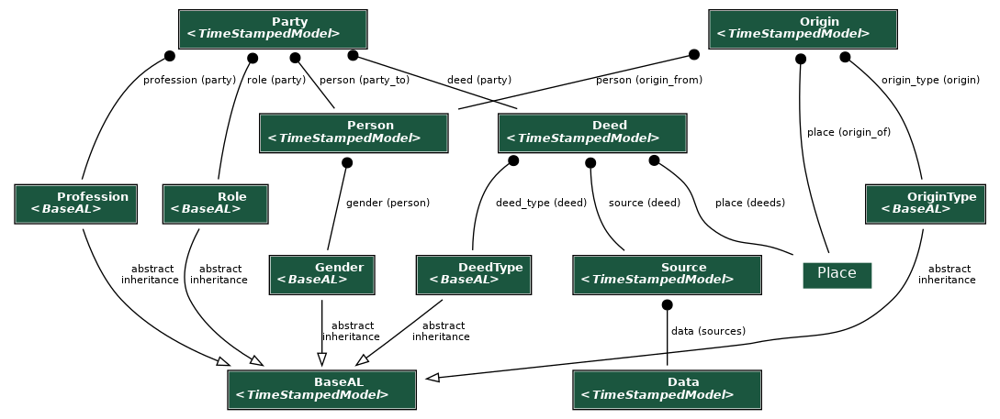
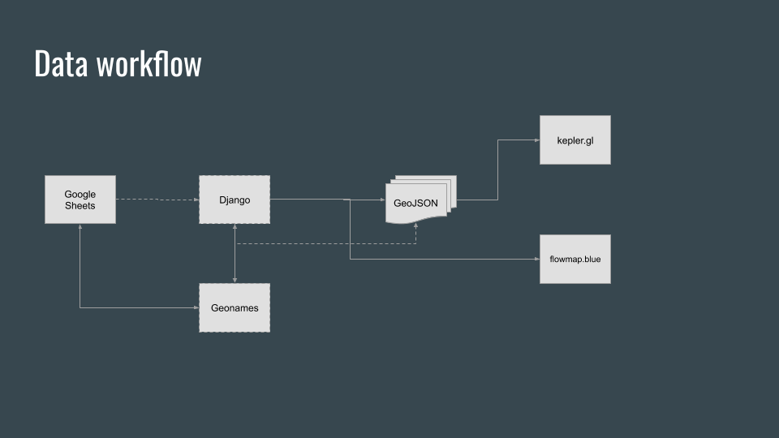
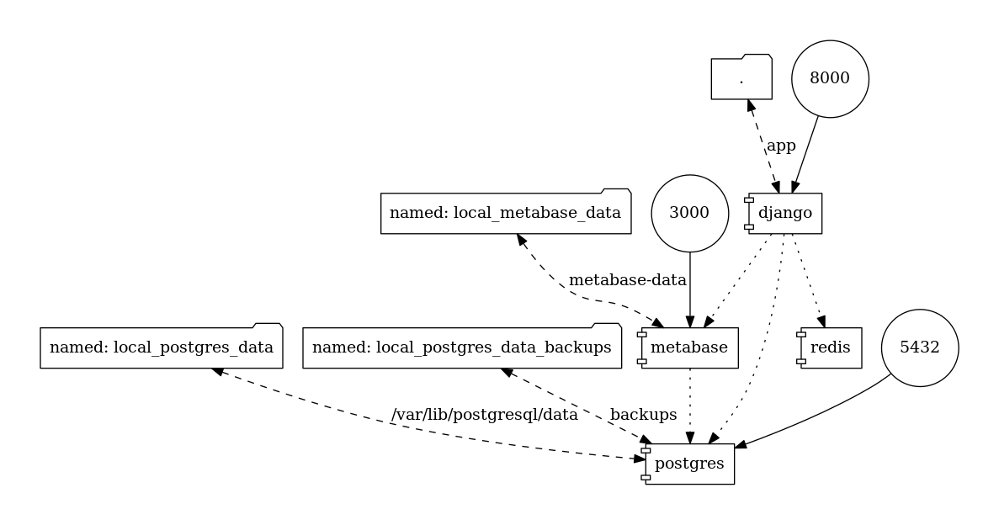

.. _technical-overview:
.. highlight:: bash

Technical Overview
==================

Team
----

.. literalinclude:: ../etat_civil/static/humans.txt
    :language: text
    :start-after: /* TEAM */
    :end-before: /* SITE */

Technologies and Processes
--------------------------

Development
^^^^^^^^^^^

For more information see `development`_ and `development with docker`_.

.. _development: https://cookiecutter-django-kingsdigitallab.readthedocs.io/en/latest/developing-locally.html
.. _development with docker: https://cookiecutter-django-kingsdigitallab.readthedocs.io/en/latest/developing-locally-docker.html

Data model
^^^^^^^^^^

    Django models

The data model graph was generated with the `django-extensions graph_models`_
command::

    $ ./bake.py manage graph_models deeds -X TimeStampedModel  --disable-fields --disable-abstract-fields -o models.png

.. _django-extensions graph_models: https://django-extensions.readthedocs.io/en/latest/graph_models.html

Below is an example of how the model is used to record information on one deed (Etat Civil Ismaïlia 1872-1882).

- Deed:

  - ID: 1; acttype: 1; n: 21; date: 24 déc. 1872; place: 1; source: 1
  
- Person:

  - ID: JMS; name: Joseph Marius Silvy; year of birth: 1842
  - ID: TB; name: Thérèse Blaum; year of birth: 1848

- Party:

  - Deed: 1; person: JMS; role: 2; profession: 2
  - Deed: 1; person: TB; role: 1; profession: 1

- Origin:

  - Person: JMS; place: 2; originype: 1
  - Person: TB; place: 3; origintype: 2
  
- DeedType:

  - 1: Birth
  - 2: Death
  - 3: Marriage
  
- Place:

  - 1: Ismaïlia; Egypt
  - 2: Département de la Haute-Garonne; Saint-Marcel; France
  - 3: Département des Pyrénées-Orientales; Collioure; France

- OriginType:

  - 1: Birth
  - 2: Origin

- Profession:
  - 1: Sans profession
  - 2: Mécanicien
  
- Role:

  - 1: Mother
  - 2: Father
  
- Source:

  - 1: Classmark: Ismaïlia 1; microfilm: P 07070
  - 2: Classmark: Le Caire 1; microfilm: P 06505

Workflows
^^^^^^^^^
The Django app imports data from the the CSV files (derived from project Google Sheet), adds geographic locations to places, and provides an admin interface to manage the data (with simple filtering). After the curation and cleaning up is done in the Django admin, the app exports data into GeoJSON format to support map visualisations.

Architecture
^^^^^^^^^^^^
TODO: Extract high level description from PQ

    Local Docker Stack

The graphs were generated by the docker-compose-viz_ tool::

    $ docker run --rm -it --name dcv -v $(pwd):/input pmsipilot/docker-compose-viz render -m image local.yml

.. _docker-compose-viz: https://github.com/ahmadawais/Emoji-Log

Design process
--------------

The project makes uses of two existing tools to generate map visualisations:

- Kepler.gl_ is an open source geospatial analysis tool for large-scale data sets
- Flowmap_ is a more minimal solution to create geographic flow maps from data published (not private) in Google Sheets. It allows to visualize numbers of movements between locations (origin-destination data) and explore the data interactively; however on a limited number of parameters (from, to and count). See the Flowmap version_ based on Etat Civil data.

Description of this proof of concept with historical introduction are available on the Harvard Harvard and Cambridge Centre for History and Economics Visualising Historical Networks project webpages (TOADD specific link: https://histecon.fas.harvard.edu/visualizing/index.html).

.. _Kepler.gl: https://kepler.gl/
.. _Flowmap: https://flowmap.blue/
.. _version: https://flowmap.blue/1hsU13EUFyX8m9xp7GYGGEMyC1bZ8_9sU6b4e2KHwVSc?v=36.754487,19.319729,2.02,0,0&a=1&b=1&bo=88&c=0&d=0&lt=1&lfm=ALL&col=SunsetDark&f=35 

